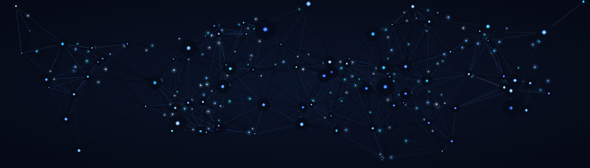

# Ali Muhammad

<p align="center">
  
</p>

<p align="center">
  
</p>

<p align="center">
  <a href="https://komarev.com/ghpvc/?username=Ali18-code">
    
  </a>
  <a href="https://github.com/Ali18-code?tab=followers">
    
  </a>
  <a href="https://www.linkedin.com/in/alimuhammadpanhwar">
    
  </a>
  <a href="mailto:am6470224@gmail.com">
    
  </a>
</p>

---

<br/>

<table width="100%">
<tr>
<td width="55%" valign="top">

## About Me

I am an aspiring **AI/ML Engineer** and **Web Developer** passionate about building intelligent systems that solve real problems. From machine learning models and data pipelines to modern web apps — I focus on learning by doing and sharing the journey publicly.

Currently a **BSCS student at Air University, Islamabad** (2024–2028), building strong foundations in Python, ML, and deep learning while working on real-world projects.

<br/>

**What defines my work:**
- Learning by building real projects, not just tutorials
- Clean, well-structured code
- Sharing progress publicly — building in the open
- Always exploring new AI tools and techniques

</td>
<td width="45%" valign="top">

<br/>

```python
class AliMuhammad:

    name       = "Ali Muhammad Panhwar"
    role       = "Aspiring AI/ML Engineer"
    university = "Air University, Islamabad"
    degree     = "BSCS (2024 - 2028)"

    skills = [
        "Python",
        "Machine Learning",
        "Deep Learning",
        "Web Development",
    ]

    currently_learning = [
        "PyTorch & Neural Networks",
        "AI Agents",
        "Data Science",
    ]

    motto = "Build. Learn. Share. Repeat."
```

</td>
</tr>
</table>

---

## Connect With Me

<p align="left">
  <a href="https://www.linkedin.com/in/alimuhammadpanhwar" target="_blank">
    
  </a>
  <a href="mailto:am6470224@gmail.com" target="_blank">
    
  </a>
  <a href="https://ali-muhammad-portfolio-three.vercel.app" target="_blank">
    
  </a>
  <a href="https://github.com/Ali18-code" target="_blank">
    
  </a>
</p>

---

## Tech Stack

<table width="100%">
<tr>
<td width="50%" valign="top">

**Languages**


<br/>

**AI / ML**


</td>
<td width="50%" valign="top">

**Web & Frameworks**


<br/>

**Tools & Platforms**


</td>
</tr>
</table>

---

## Featured Projects

> Three projects that best represent my skills, problem-solving ability, and range across AI/ML and web development.

<table width="100%">
<tr>
<td width="50%" valign="top">

### 📧 Email Spam Classifier

<a href="https://github.com/Ali18-code/email-spam-classification">View Repository</a>

A **machine learning model** that classifies emails as spam or not spam with an interactive UI. Built with a full preprocessing pipeline, feature extraction, and model evaluation.

**What makes it stand out:**
- Complete ML pipeline from raw data to prediction
- Interactive user interface for testing
- Model comparison and evaluation metrics
- Clean, reproducible code

**Stack:**


</td>
<td width="50%" valign="top">

### 🎯 FocusFlow

<a href="https://github.com/Ali18-code/FocusFlow">View Repository</a>

A **desktop productivity app** with tasks, habits, Pomodoro timer, and stats tracking — built to help you stay focused and build better daily habits.

**What makes it stand out:**
- Full task and habit management system
- Built-in Pomodoro timer with stats
- Progress tracking and analytics
- Clean desktop UI

**Stack:**


</td>
</tr>
<tr>
<td width="50%" valign="top">

### 🌐 Portfolio Website

<a href="https://ali-muhammad-portfolio-three.vercel.app">View Live Site</a>

A **personal portfolio** showcasing my projects, skills, and journey as an aspiring AI/ML engineer. Built with modern web technologies and smooth animations.

**What makes it stand out:**
- Modern, responsive design
- Smooth animations with Framer Motion
- Project showcase with live demos
- Fast loading with Vite

**Stack:**


</td>
<td width="50%" valign="top">

</td>
</tr>
</table>

---

## All Projects

| Project | Description | Stack | Status |
|:--------|:-----------|:------|:-------|
| [Email Spam Classifier](https://github.com/Ali18-code/email-spam-classification) | ML model to classify emails as spam or not spam | Python, Scikit-Learn | Public |
| [FocusFlow](https://github.com/Ali18-code/FocusFlow) | Desktop productivity app — tasks, habits, Pomodoro timer | Python | Public |
| [Portfolio Website](https://ali-muhammad-portfolio-three.vercel.app) | Personal portfolio showcasing projects & skills | React, Tailwind CSS | Public |

---

## GitHub Analytics

<div align="center">
  
</div>

<br/>

<div align="center">
  
  
</div>

<br/>

<div align="center">
  
</div>

---

## Certifications & Achievements

### Certifications

| Certification | Issuer | Issued | Credential ID |
|:-------------|:-------|:-------|:-------------|
| Google AI Essentials (5-course Specialization) | Google × Coursera | Sep 2026 | T4SQX637Q6RK |
| Mastering Claude Code: From Setup to Real Projects | Coursera (SkillsBooster Academy) | Aug 2026 | F230WIWM57KL |
| Mastering ChatGPT: All ChatGPT Features and Functions | Udemy | Aug 2026 | UC-3210318a |

### Skill Tags Earned Across Certifications


---

## What I Am Building Toward

```
2024 — 2026 Roadmap
├── Python & Programming Foundations ✅
├── Math & Statistics for ML
├── Data Structures & Algorithms
├── Machine Learning Fundamentals
├── PyTorch & Deep Learning
├── Generative AI & LLMs
└── AI Agents & Deployment
```

---

<p align="center">
  
</p>

<p align="center">
  Thank you for visiting. If my work interests you, feel free to connect, collaborate, or simply say hello.
</p>

<p align="center">
  <a href="https://www.linkedin.com/in/alimuhammadpanhwar"></a>
  <a href="mailto:am6470224@gmail.com"></a>
  <a href="https://ali-muhammad-portfolio-three.vercel.app"></a>
</p>

<div align="center">
  
</div>
